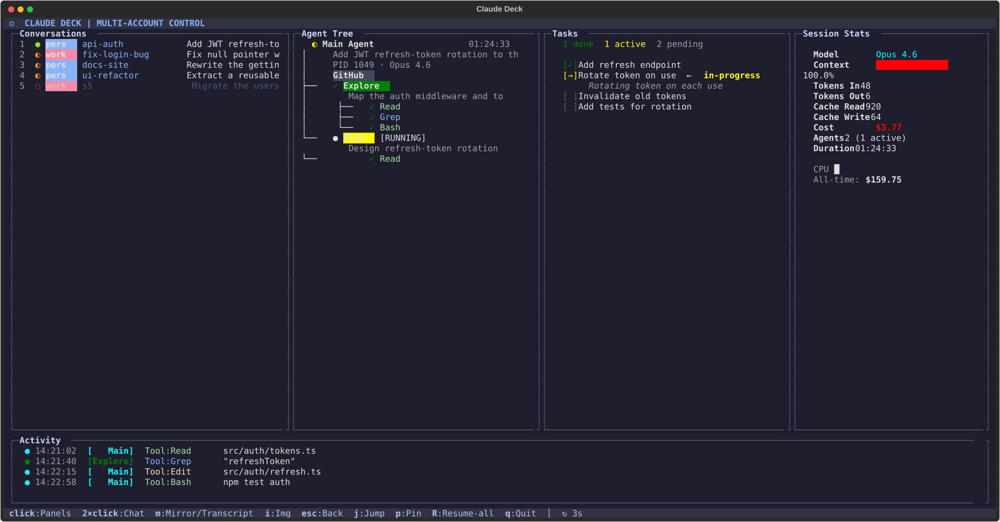
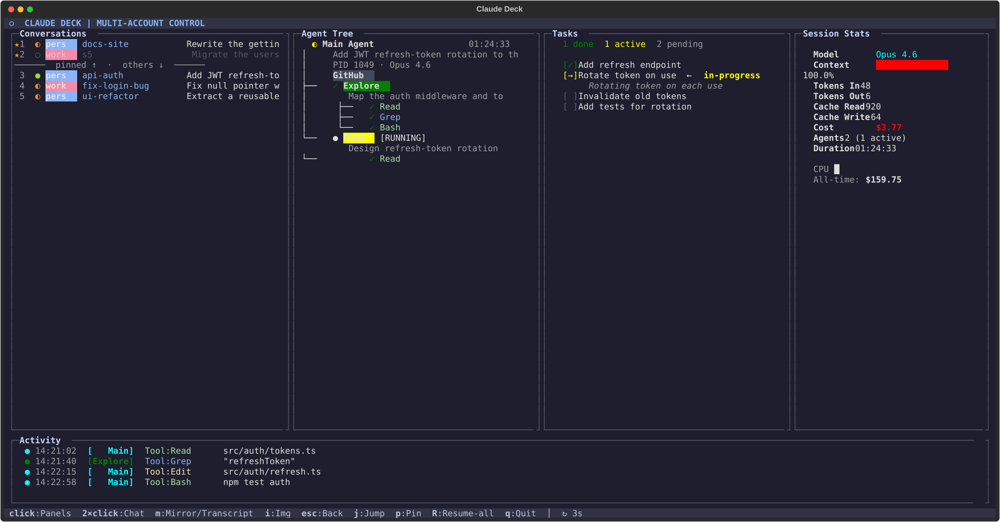
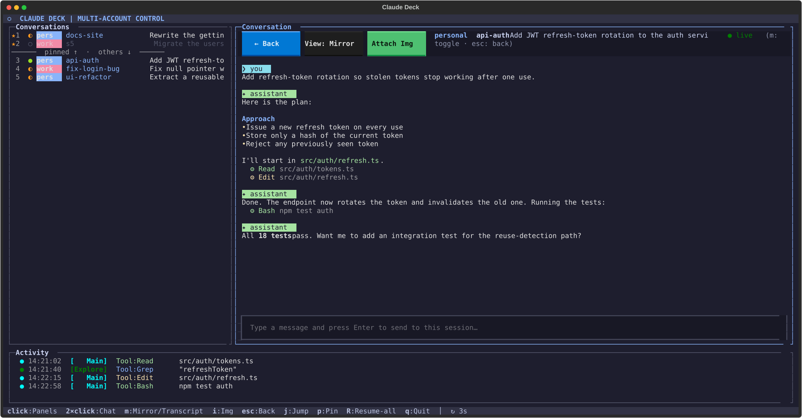

# claude-deck

A terminal control deck for [Claude Code](https://claude.com/claude-code) sessions.

`claude-deck` is a TUI (text user interface) that watches every running Claude
Code session across all of your accounts and gives you one place to see what
each agent is doing, jump to its terminal tab, mirror its live screen, read a
colored transcript, send it a message, pin the conversations you care about, and
browse every past conversation to resume it.

It reads Claude Code's own local files under `~/.claude` (and any extra account
dirs), so it needs no API key and sends nothing to the network.

> Status: community project, early days. Issues and pull requests are welcome.

---

## Screenshots

The dashboard: the Conversations list on the left, with the selected session's
agent tree, tasks, and stats.



Pin the conversations you care about — they group at the top, above a divider.



Double-click a conversation to open its colored transcript (and, on a live
session, send it a message right from the box at the bottom).



> Screenshots use mock demo data.

---

## Features

- **Conversations, all accounts** — one list of your live and recent Claude Code
  sessions, newest first, with an account badge, a busy/idle/ended dot, the clean
  session name (e.g. `api-auth`), summary, tokens, and cost.
- **Pinned section** — pin the conversations you care about; they group at the top
  above a divider and survive restarts.
- **Session dashboard** — single-click a conversation to point the Agent Tree,
  Tasks, and Session Stats panels at it.
- **Open the chat** — double-click a conversation to open an embedded pane.
- **Colored transcript** — a readable, syntax-lit reconstruction of the
  conversation (you / assistant / tool calls) tailed from the session log.
- **Live screen mirror** — see the real terminal output of a running session
  without leaving the deck (macOS + iTerm2).
- **Send input** — type a message (or attach a clipboard image) and send it to a
  live session (macOS + iTerm2).
- **Jump to the tab** — focus the exact iTerm2 tab running a session (macOS +
  iTerm2).
- **Resume list** — browse every past conversation across all accounts and open
  it.

---

## Platform support

The monitoring and reading features work on any OS. The features that drive your
terminal (jump, mirror, send input, attach image) use AppleScript and therefore
need **macOS with [iTerm2](https://iterm2.com)**.

| Feature | Requirement |
| --- | --- |
| Conversations list, dashboard, transcript, stats, pins, resume | any OS |
| Jump to tab, live screen mirror, send input, attach image | macOS + iTerm2 |

On Linux/Windows the terminal-driving keys simply show a notice; everything else
works.

---

## Requirements

- Python 3.8+
- [Claude Code](https://claude.com/claude-code) installed and used at least once
  (so there is data under `~/.claude`)
- Python packages: `textual` and `rich` (see `requirements.txt`)
- For jump / mirror / input / image: macOS and iTerm2

---

## Install

```bash
git clone https://github.com/SesisnandoLRNeto/claude-deck.git
cd claude-deck

# Install dependencies (a virtualenv is recommended)
python3 -m pip install -r requirements.txt

# Run it directly...
./claude-deck

# ...or put it on your PATH so you can run `claude-deck` from anywhere
mkdir -p ~/.local/bin
ln -s "$(pwd)/claude-deck" ~/.local/bin/claude-deck
# make sure ~/.local/bin is on your PATH (add to ~/.zshrc or ~/.bashrc if needed):
#   export PATH="$HOME/.local/bin:$PATH"
```

If `textual` or `rich` are missing, the program tells you the exact `pip`
command to run.

### macOS automation permission

The first time you jump to, mirror, or send input to a session, macOS asks for
permission for your terminal to control iTerm2 (a one-time prompt). Approve it.
You can review it later under
**System Settings → Privacy & Security → Automation**.

---

## Usage

Start it:

```bash
claude-deck
```

It refreshes every 3 seconds.

### Keys

| Key | Action |
| --- | --- |
| `single click` | Show that session's dashboard (Agent Tree / Tasks / Stats) |
| `double click` | Open the conversation (chat) pane |
| `m` | Toggle the chat between colored transcript and live screen mirror |
| `i` | Attach the clipboard image to the message (macOS + iTerm2) |
| `Enter` (in the input box) | Send your message to the live session |
| `j` | Jump to the real iTerm2 tab of the highlighted session |
| `p` | Pin / unpin the highlighted conversation |
| `R` | Toggle the list between recent and all conversations (resume) |
| `Esc` | Back from the chat to the dashboard |
| `q` | Quit |

---

## Multiple accounts

`claude-deck` auto-discovers Claude Code config directories:

- `~/.claude` (shown as **personal**)
- `~/.claude-work` (shown as **work**, if present)
- whatever `CLAUDE_CONFIG_DIR` points to (shown as **env**, if set)

If you only use one account, you just see that one. To add your own accounts or
change the labels/colors, edit `discover_config_dirs()` near the top of the
script.

---

## How it works

- Live sessions come from `ps` (processes named `claude`); liveness is never
  inferred from on-disk files (those can be stale).
- Each running process is matched to its session and account through
  `<config-dir>/sessions/<pid>.json`.
- Conversations are read from `<config-dir>/projects/<cwd>/<session-id>.jsonl`.
- Jump, mirror, and input talk to iTerm2 via `osascript`, matching the session's
  TTY (e.g. `/dev/ttys006`).
- Pins are stored in `~/.claude/monitor-pins.json`.

Nothing leaves your machine.

---

## Known limitations

- The live mirror is plain text. iTerm2's scripting returns the screen contents
  without color, so the mirror is uncolored; the transcript view is the colored
  one.
- The mirror shows the visible viewport only (no scrollback).
- Terminal-driving features are iTerm2-only for now. Support for other terminals
  (Terminal.app, tmux, Kitty, WezTerm) is a good contribution.

---

## Contributing

This is meant to be customized by the community. Useful directions:

- Support more terminals for jump/mirror/input.
- A colored mirror via the iTerm2 Python API.
- Per-account filters, search, and sorting in the list.
- Actually relaunch `claude --resume <id>` in a new tab from the resume list.
- Pricing table updates as models change.

Open an issue to discuss an idea, or send a pull request. Please keep it a single
dependency-light script that runs with just `textual` and `rich`.

---

## License

[MIT](LICENSE)

This is an independent community tool. It is not affiliated with or endorsed by
Anthropic. "Claude" and "Claude Code" are trademarks of their respective owner.
